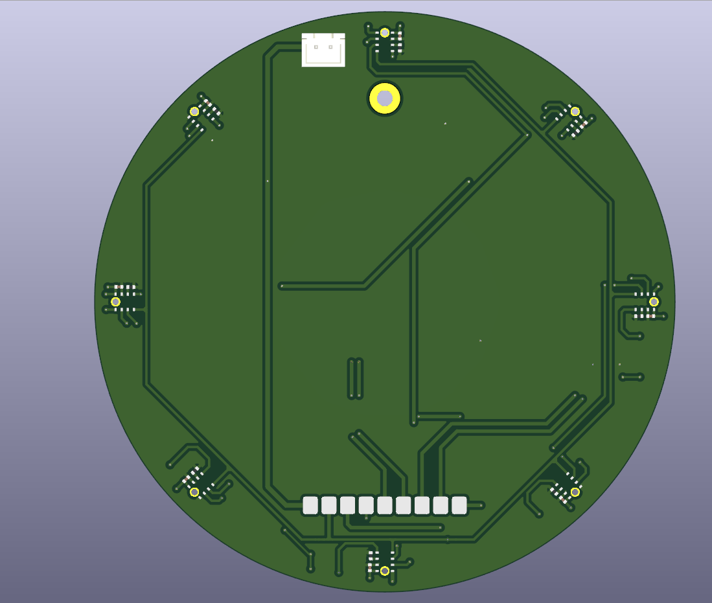
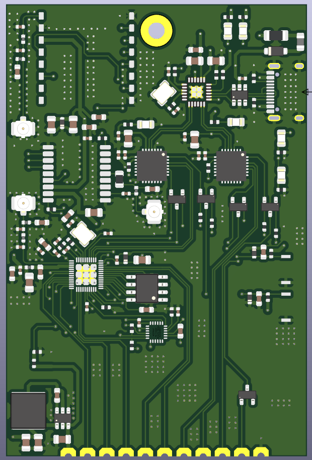
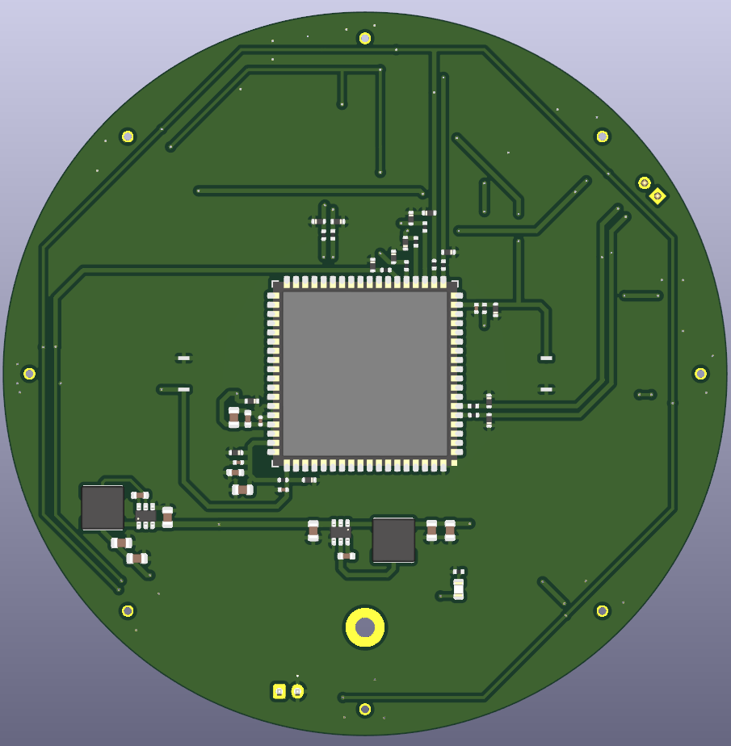
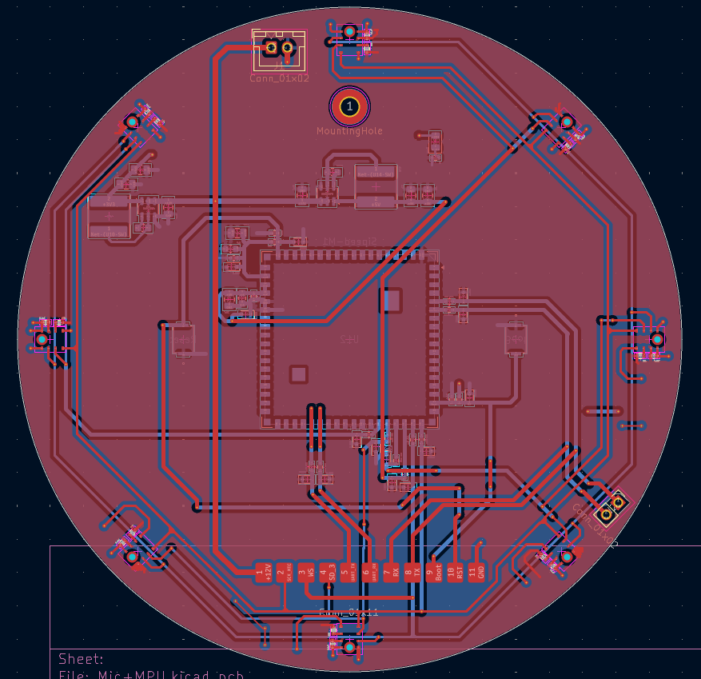
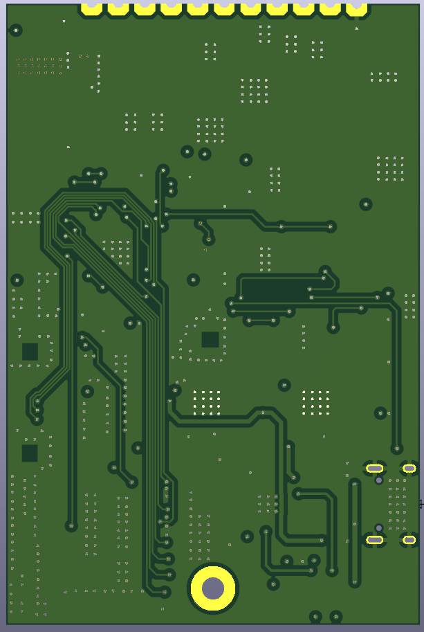
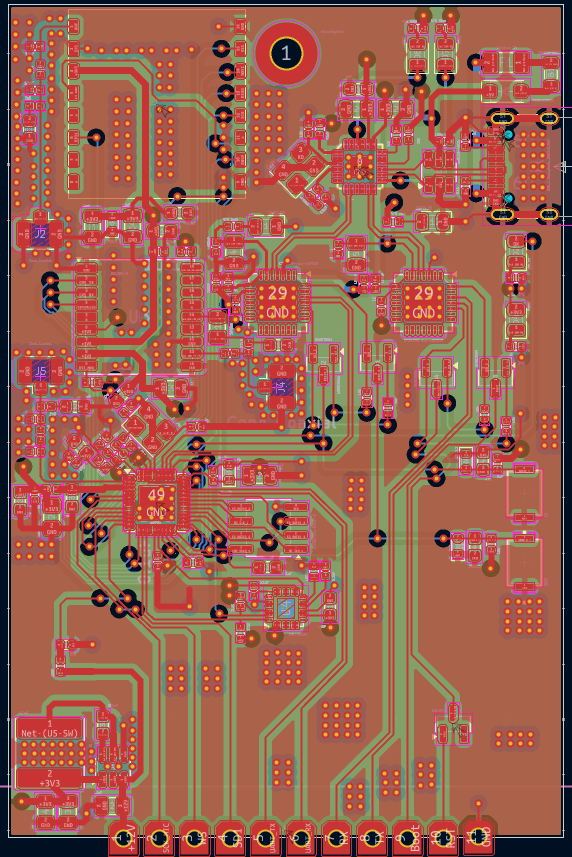
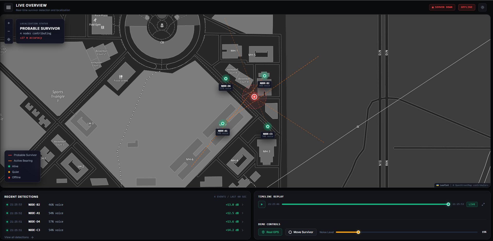

# Acoustic Sensing Node

**Team:** Aninda Majumdar ([@irocobble](https://github.com/irocobble)) · Subham Basak · Kartik Kajra

A **two-board, field-deployable acoustic sensor** for search-and-rescue. The node
is placed in rubble or debris and listens for signs of a trapped person (voice,
tapping, banging). It works out **which direction** the sound came from and
sends a GPS-tagged alert over LoRa to a rescue dashboard.

Searching collapsed structures is a race against time, and the hardest question
is *where to dig*. Instead of sending people onto unstable rubble to listen, the
node sends the ears in first.

<p align="center">
  
  &nbsp;
  
  <br>
  <em>Left: Board 1, the 8-mic array (2-layer, Ø100 mm). Right: Board 2, the main board (4-layer, 50 × 75 mm).</em>
</p>

---

## Contents

1. [How it works](#how-it-works)
2. [Architecture](#architecture)
3. [Why two boards](#why-two-boards)
4. [Hardware](#hardware)
5. [Microphone array](#microphone-array)
6. [Board-to-board interface](#board-to-board-interface)
7. [Power](#power)
8. [Signal processing on the K210](#signal-processing-on-the-k210)
9. [Voice detection model](#voice-detection-model)
10. [Host software and dashboard](#host-software-and-dashboard)
11. [Prototype results](#prototype-results)
12. [Project status](#project-status)
13. [Open items](#open-items)
14. [Repository layout](#repository-layout)
15. [Getting started](#getting-started)
16. [Engineering notes](#engineering-notes)
17. [Roadmap](#roadmap)
18. [References](#references)

---

## How it works

```
 sound ──▶ 8 MEMS mics ──▶ K210 ──────────────────────────▶ ESP32 ──▶ LoRa ──▶ rescue dashboard
                           │ 1. capture all channels,          │ adds GPS position,
                           │    sampled on the same clock      │ IMU data, timestamp
                           │ 2. "is this a human voice?"       │
                           │ 3. "which direction?"             │
                           └─ sends only the result ───────────┘
                              (angle, confidence, voice yes/no)
```

1. **Listen.** Eight digital microphones sit on a 90 mm circle. They all run
   off one shared clock, so the tiny arrival-time differences between them are
   real and measurable.
2. **Decide.** A small voice-detection model running on the K210 decides
   continuously whether the sound looks like a human voice.
3. **Locate.** The K210 compares the signals from opposite microphones
   (GCC-PHAT) to find the arrival-time difference, then turns it into a bearing.
4. **Report.** Only the result (angle, confidence, level, voice flag) goes to the
   ESP32. No raw audio crosses between the boards.

The K210 stays **powered and listening all the time**. It is not duty-cycled.

---

## Architecture

The system is split across **two boards** that solder together along an 11-pin
castellated edge.

| Board | Layers | Size | Carries |
|---|---|---|---|
| **Board 1: Mic array** | 2 | Ø100 mm | 8× INMP441, Kendryte K210 (Sipeed M1), 12 V→5 V and 12 V→3V3 regulators |
| **Board 2: Main** | 4 | 50 × 75 mm | ESP32 (QFN-48), SX1262 LoRa, MAX-M10S GNSS, MPU-9250 IMU, USB-C hub + 2× USB-UART, 12 V→3V3 regulator |

| Processor | Role |
|---|---|
| **Kendryte K210** (Sipeed M1) | Everything acoustic: I2S master for the array, voice detection, direction finding |
| **ESP32** (QFN-48, 5 × 5 mm) | System host: LoRa, GNSS, IMU, USB, alert formatting |

**Why the K210?** A single K210 I2S peripheral has **four data inputs driven by
one clock generator**. With two microphones per data line, that is eight
channels sampled on exactly the same clock edges. Direction finding depends
entirely on that, and the K210 provides it with nothing to synchronise. It also
has a hardware FFT unit and an audio processor (APU) that can do beamforming,
which we plan to evaluate later.

```
                 ┌──────────────────────────────────────────┐
                 │  BOARD 1: Mic array  (2-layer, Ø100 mm)  │
   8× INMP441 ───┤                                          │
   circle,       │  I2S: 4 data lines, 1 shared clock       │
   r = 45 mm     │            ↓                             │
                 │  K210 / Sipeed M1  (always on)           │
                 │   · voice detection (3-feature model)    │
                 │   · direction of arrival (GCC-PHAT)      │
                 └───────────────┬──────────────────────────┘
                                 │  11-pin castellated edge
                                 │  12 V · mic clock · 2× UART · boot/reset
                 ┌───────────────┴──────────────────────────┐
                 │  BOARD 2: Main  (4-layer, 50 × 75 mm)    │
                 │  ESP32 ── SX1262 LoRa      → U.FL        │
                 │        ── MAX-M10S GNSS    → U.FL        │
                 │        ── MPU-9250 IMU                   │
                 │        ── Wi-Fi/BLE        → U.FL        │
                 │  USB-C → CH334F hub → 2× CP2102N         │
                 └──────────────────────────────────────────┘
```

The IMU is there on purpose. Tapping on rubble produces both a sound and a
vibration. Requiring both reduces false alarms in a way an acoustic-only system
cannot.

---

## Why two boards

The two halves of the design have **opposite needs**:

| | Mic array | Main electronics |
|---|---|---|
| What sets the size | **Physics**: the mics must be far apart to measure direction | **Density**: as small as routing allows |
| Area | Ø100 mm (≈ 7,850 mm²) | 50 × 75 mm (3,750 mm²) |
| Signals | Slow I2S lines, no RF | 3 RF paths, USB, fine-pitch parts |
| Layers needed | **2** | **4** |

On a single board, the whole area would have to be 4-layer, because the LoRa,
GNSS and Wi-Fi antenna feeds need a solid ground plane and 50 Ω traces. We
would be paying 4-layer prices for a large area whose only job is holding
microphones 45 mm from the centre.

### Real cost (as ordered)

Both boards were ordered from **Robu.in**. Prices include shipping.

| Board | Layers | Area | Price paid | Price per mm² |
|---|---|---|---|---|
| Board 1: Mic array | 2 | ≈ 7,850 mm² | **₹900** | ≈ ₹0.115 |
| Board 2: Main | 4 | 3,750 mm² | **₹1,800** | ≈ ₹0.48 |
| **Total (split design)** | | | **₹2,700** | |

On our order, **4-layer cost ≈ 4.2× more per mm² than 2-layer.**

What a single 4-layer board would have cost, at the same ₹0.48/mm²:

| Single-board option | Area | Estimated price | Saving from splitting |
|---|---|---|---|
| Ø100 mm round (smallest that holds the array) | ≈ 7,850 mm² | ≈ ₹3,770 | ≈ 28% |
| 100 × 100 mm (more realistic once both boards' parts fit) | 10,000 mm² | ≈ ₹4,800 | ≈ 44% |

**The split saves roughly 28–44% on bare PCBs.** This is an estimate: fabs have
minimum charges and quantity tiers, so price is not exactly proportional to area.
It is still a fair comparison because both quotes came from the same supplier.

Benefits that do not show up on the invoice:

- **Cheap iteration.** The array geometry is the least certain part of the
  design. Changing it means a new 2-layer board, not a new 4-layer one.
- **Contained failure.** A damaged mic board does not scrap the main board.
- **Assembly yield.** The finest-pitch parts (ESP32 QFN-48 at 0.35 mm,
  2× QFN-28, QFN-24) are all on the small board.
- **RF kept away from audio.** The three antennas are physically separated from
  the microphone traces.

**The trade-off:** the castellated joint is a new failure point and cannot be
probed once soldered. That is why only slow signals cross it: no RF, no
high-speed bus.

---

## Hardware

### Board 1: Mic array (`Board1_2layers/Mic+MPU/`)

| Function | Device | Ref |
|---|---|---|
| Acoustic processor | Sipeed M1 (Kendryte K210) | U12 |
| Microphones | 8× INMP441 I2S MEMS | U1–U6, U15, U16 |
| Buck 12 V → 5 V (K210) | AP63205WU | U14 |
| Buck 12 V → 3V3 (mics) | AP63203WU | U10 |
| Power input | JST-XH 2-pin, polarised | J1 |
| Board interface | 11-pin castellated, 3.2 mm pitch | J3 |
| Buttons | Boot, Reset | SW4, SW3 |

> The `Mic+MPU` folder name is historical. The MPU-9250 is on Board 2.

<p align="center">
  
  &nbsp;
  
  <br><em>Board 1, top and bottom. The microphone sound holes are on the bottom face.</em>
</p>

<p align="center">
  
  <br><em>Board 1 layout in KiCad.</em>
</p>

### Board 2: Main (`board2_4layers/`)

| Function | Device | Ref |
|---|---|---|
| Host MCU | ESP32 (QFN-48, 5 × 5 mm) | U7 |
| External SPI flash | SPI NOR, SOIC-8 | U6 |
| LoRa transceiver | SX1262 module | U1 |
| GNSS receiver | u-blox MAX-M10S | U3 |
| IMU | MPU-9250 (9-axis) | U4 |
| USB hub | CH334F | CH334F1 |
| USB-UART bridges (ESP32 + K210) | 2× CP2102N | U8, U9 |
| USB ESD protection | USBLC6-4SC6 | U2 |
| Buck 12 V → 3V3 | AP63203WU | U5 |
| Antennas | 3× U.FL: LoRa, GNSS, Wi-Fi | J2, J4, J5 |
| USB connector | USB Type-C | J1 |
| Crystals | 40 MHz (ESP32), 12 MHz (hub) | Y2, Y1 |
| Buttons | EN, BOOT | SW1, SW2 |

Stack-up: GND on F.Cu, In1.Cu and B.Cu; +3V3 on In2.Cu.

<p align="center">
  
  &nbsp;
  
  <br><em>Board 2, top and bottom.</em>
</p>

<p align="center">
  
  <br><em>Board 2 layout in KiCad.</em>
</p>

---

## Microphone array

Eight INMP441 digital microphones on a circle of **radius 45.00 mm**, spaced
45° apart. Each one is rotated to face the centre, so every microphone has the
same trace shape back to the K210.

Two microphones share each data line. The INMP441's `L/R` pin decides which
half of the stereo frame each one uses: one takes the left slot, the other the
right.

| Data line | K210 pin | Mics | Angles |
|---|---|---|---|
| `SD_1` | IO20 | U1, U2 | 90°, 45° |
| `SD_2` | IO21 | U5, U6 | 0°, 315° |
| `SD_3` | IO22 | U15, U16 | 270°, 225° |
| `SD_4` | IO23 | U3, U4 | 180°, 135° |
| `SCK_MIC` | IO18 | shared bit clock | |
| `WS` | IO19 | shared word select | |

All eight sample on the same bit clock, so every channel is **phase-coherent**.
This is exactly what direction finding needs, and it is why digital MEMS mics
were chosen over analog mics behind a multiplexed ADC.

Every K210 IO used has a **200 Ω series resistor and an ESD diode**, as Sipeed
requires for the M1 module.

> **Sound enters from the bottom.** Each mic sits over a 1.05 mm hole through
> the PCB, so the openings in the enclosure must be on the bottom face.

**Geometry numbers:**

| Quantity | Value | Why it matters |
|---|---|---|
| Adjacent mic spacing | 2r·sin(22.5°) = 34.4 mm | Spatial aliasing above c / (2 × 0.0344) ≈ **5.0 kHz** |
| Opposite mic spacing | 90 mm | Longest baseline, best angle resolution |
| Max arrival-time difference | 90 mm / 343 m/s ≈ 262 µs | Only ≈ **4.2 samples** at 16 kHz, so sub-sample timing is required |

> **About IO20.** On the Sipeed **Maix development board**, IO20 is wired to the
> board's own onboard microphone, so it cannot be used for an external mic there.
> On our PCB the bare **M1 module** is used, which has no onboard microphone, so
> IO20 is free. This only matters if you test the firmware on a Maix board.

---

## Board-to-board interface

11 positions, 3.2 mm pitch, castellated. Board 2 solders directly onto Board 1,
with no connector and no cable.

| Pin | Net | Direction | Purpose |
|---|---|---|---|
| 1 | `+12V` | → Board 2 | Unregulated; each board regulates locally |
| 2 | `SCK_MIC` | K210 → ESP32 | Mic bit clock |
| 3 | `WS` | K210 → ESP32 | Mic word select |
| 4 | `SD1` | mics → ESP32 | Lets the ESP32 hear one mic pair (spare / diagnostics) |
| 5 | `UART_TX` | ESP32 → K210 | Commands |
| 6 | `UART_RX` | K210 → ESP32 | Results: voice flag, confidence, bearing |
| 7 | `RX` | K210 → CP2102N | K210 programming, transmit |
| 8 | `TX` | CP2102N → K210 | K210 programming, receive |
| 9 | `Boot` | CP2102N → K210 | IO16 boot-mode select |
| 10 | `RST` | CP2102N → K210 | Reset (1.8 V domain) |
| 11 | `GND` | | Return |

`TX` and `RX` on pins 7–8 are named **from the USB bridge's point of view** on
both boards.

Pins 2–4 were originally intended for a low-power wake detector on the ESP32.
Since the K210 now stays on all the time, that wake path is not needed. The
pins stay as a spare way for the ESP32 to listen to one mic pair. If used, the
ESP32 must be an I2S **slave**, because the K210 drives the clock.

**No raw audio crosses the joint in normal operation.** The mics feed the K210
directly; the UART carries only results.

---

## Power

```
12 V in (JST-XH, polarised)
   │
   ├── Board 1 ── AP63205 ──▶ +5V   → Sipeed M1 (K210)
   │           └─ AP63203 ──▶ +3V3  → 8× INMP441
   │
   └── via J3 pin 1 ──▶ Board 2 ── AP63203 ──▶ +3V3
                                     → ESP32, SX1262, MAX-M10S, MPU-9250, flash
```

Only 12 V and GND cross the joint, so no regulated rail loses voltage across it
and the RF and audio sections do not share regulator noise.

**Estimated ≈ 3.3 W total (≈ 320 mA at 12 V)**, mostly the K210 (≈ 1.5 W).
This is an estimate and will be measured once the boards are assembled.

---

## Signal processing on the K210

The firmware is plain C on the **kendryte-standalone-sdk**, in two CMake projects:

| Project | Build flag | Output | Use |
|---|---|---|---|
| Recorder | `-DPROJ=Recorder` | `Recorder.bin` | Streams raw mic audio to the PC for datasets and calibration |
| Detector | `-DPROJ=Detector` | `Detector.bin` | Runs voice detection and direction finding on the chip |

### Capture

- 16 kHz nominal. The K210's PLL gives a real rate of about **15,986 Hz**. The
  difference is small and does not affect the results.
- Samples are 32-bit from the INMP441, shifted down to 16-bit
  (`SAMPLE_SHIFT = 13`, the smallest shift where no channel clips).
- The conversion to 16-bit **saturates** instead of wrapping. A wrapped sample
  looks like a loose wire, which is very confusing during debugging.
- A **100 Hz high-pass filter** (4th-order Butterworth) removes rumble and DC
  before anything else.

### Direction of arrival (GCC-PHAT)

For each pair of opposite microphones:

1. Take a **1024-point FFT (64 ms)** of both channels.
2. Compute the cross-spectrum and divide each bin by its own magnitude
   (the **PHAT** weighting). This keeps only phase, which is what carries timing.
3. **Keep only 300–3400 Hz** (the speech band). Without this mask, the empty
   bins are amplified to the same weight as real ones and the answer is
   essentially random. Measured: a true delay of 1.50 samples was estimated as
   0.14 unmasked and 1.49 masked.
4. **Search for the delay directly at fractional lags.** A coarse pass in
   0.10-sample steps, then a fine pass in 0.01-sample steps around the best one.
   Each lag is evaluated with the FFT shift theorem, so no curve-fitting is
   needed. This matters because the whole array spans only about 4 samples of
   delay; whole-sample steps would give very coarse bearings.
5. The search range comes from the spacing:
   `max lag = spacing / c × fs × 1.4` (40% extra for echoes and measurement error).
6. Two perpendicular pairs give `lag_x` and `lag_y`, and the bearing is
   `atan2(lag_y, lag_x)`.
7. Results are rejected if the sound is too quiet (`-45 dB` level gate), the
   correlation is too weak (`< 0.08`), or the delay is impossibly large.

Direction finding runs on **any loud enough sound**, not only on speech. The
voice flag is reported alongside it.

**Calibration matters.** On the prototype, two I2S channels start on different
word-select edges, which adds a constant offset between them. We measured
`lag_x` bias = **−0.93** and `lag_y` bias = **+0.95** samples, and the firmware
subtracts them (`DOA_LAG_X_BIAS`, `DOA_LAG_Y_BIAS`).

### What the array can and cannot do

- It reports **one bearing per update**: the dominant sound source. Separating
  several people talking at once needs a much larger array (roughly 0.5 m or
  more across), which is not practical for a node this size.
- It gives **direction, not distance**. On the dashboard, how far a dot is from
  the centre shows **how old** the detection is, not how far away the source is.
- Distance comes from **combining several nodes** (triangulation), which is on
  the roadmap.

### Result packet (K210 → host)

20 bytes, sent at `REPORT_HZ = 20`:

```
[5A A6] [len=0x10] [seq] [angle×10 : i16] [conf×1000 : u16] [score×100 : i16]
[level_db×10 : i16] [speech : u8] [warm : u8] [lag_x×100 : i16] [lag_y×100 : i16] [xor] [pad]
```

Raw-audio frames from the Recorder use:

```
[5A A5] [seq : u8] [blk : u16] [nch : u8] [int16 samples × blk·nch] [sum16]
```

The sequence number lets the PC detect and count dropped bytes. Before framing,
one lost byte silently turned the rest of a recording into noise while the WAV
file still looked valid.

---

## Voice detection model

A **logistic regression on 3 hand-picked features**, small enough to run on the
K210 as a single dot product.

| Feature | What it measures |
|---|---|
| `harmonicity` | Strength of the pitch peak in the autocorrelation (human pitch range, lags 40–266 samples) |
| `voice_band_ratio` | Share of energy in 300–3400 Hz (512-point Hann-window FFTs) |
| `snr_db` | Level above a rolling noise floor (20th percentile over the last 8 s) |

- Trained in Python (`Accoustic_Sensing_Node/ML/`). The feature scaler is folded into the weights and
  exported as `vad3_model.h`, so the chip does no extra scaling.
- Decision threshold (logit) **2.389**, then smoothed over **3** consecutive
  decisions (`VAD_SMOOTH_K = 3`).
- `FEATURE_VERSION = 4`. The firmware and Python feature code must match. The
  version number makes a mismatch obvious.
- Evaluation uses **grouped cross-validation by recording file**, so clips from
  the same recording never appear in both training and test. The main metric is
  **recall at 5% false-positive rate**, because false alarms are what make
  rescuers stop trusting a sensor.

### Dataset status

Our own recordings (`INMP_441_Dataset/`) are combined with public datasets
(`Public_Dataset/`). Every file goes through a quality check (dropped bytes,
clipping, DC offset, rumble, SNR) before it is used.

We also run a **confound check**: a classifier trained only on the *background*
of each recording, with the speech removed. If it can still tell the classes
apart, the model could be learning *which session* a clip came from instead of
*whether someone is speaking*.

| Dataset version | Background-only AUC | Target |
|---|---|---|
| First dataset | 0.905 – 0.94 | < 0.65 |
| Latest | **0.812** | < 0.65 |

It is improving, but still above target. Recording speech and non-speech
**interleaved in the same session, room and distance** is the fix in progress.

---

## Host software and dashboard

Python tools on the PC, all reachable from one entry point:

```
python capstone.py --help
```

| Command | What it does |
|---|---|
| `status`, `devices`, `linktest`, `inspect` | Check setup, list serial ports, test the link, inspect captures |
| `record` | Record labelled clips from the board |
| `qc`, `filters` | Dataset quality check, filter tests |
| `train`, `train-corpus`, `export` | Train the model and export `vad3_model.h` |
| `predict` | Run the model on WAV files |
| `serve`, `monitor`, `gui` | Live API + dashboard, console monitor, desktop GUI (`sar_gui.py`) |

**API server** (`api_server.py`): reads the K210's result packets from serial
and serves them over HTTP on all interfaces (port 8000 by default), so a phone
on the same Wi-Fi hotspot can open the dashboard.

| Endpoint | Returns |
|---|---|
| `/api/detections` | Detections from the last 15 s |
| `/api/state` | Latest bearing, level, voice flag |
| `/api/threshold` | Read or change the detection threshold |
| `/api/health` | Server and serial-link status |
| `/` | `dashboard.html`, the radial display |

It uses a threaded server with HTTP/1.1 keep-alive, which fixed the lag we saw
on phones over a hotspot.

<p align="center">
  
  <br><em>Live dashboard in the browser.</em>
</p>

---

## Prototype results

Before the PCBs, the full pipeline was built on a breadboard: a Sipeed Maix
board with **4 INMP441 mics in a 40 mm square**. Opposite corners are paired, so
the baseline is the square's diagonal, **56.6 mm**.

<!-- Add the photo later: save it as Accoustic_Sensing_Node/images/prototype_breadboard.jpg and delete these comment markers
<p align="center">
  
  <br><em>Breadboard prototype: Maix board + 4 INMP441 in a 40 mm square.</em>
</p>
-->

What works on the prototype:

- Phase-coherent 4-channel capture on one I2S peripheral
- On-chip voice detection and GCC-PHAT bearing, streamed live to the dashboard
- North and West bearings accurate before calibration; East and South were
  tilted until the cross-channel bias correction was added

**A measured accuracy table (true angle vs reported angle, several distances)
will be added once the PCB is assembled.** Numbers from the breadboard are not
representative of the final board, so they are not published here.

---

## Project status

### Hardware

- [x] Board 1 schematic and layout complete; 8 mics at exact geometry (r = 45.000 mm)
- [x] Board 1: K210 power, programming, boot/reset, 1.8 V reset domain; 200 Ω + ESD on every IO
- [x] Board 2 schematic and layout complete, DRC clean
- [x] Board 2: ESP32 core, LoRa, GNSS (active-antenna bias-T), IMU, USB-C hub with auto boot/reset for both processors
- [x] **Both boards ordered** (Robu.in)
- [ ] Assembly and bring-up
- [ ] Measured power consumption

### Firmware (K210)

- [x] `Recorder` and `Detector` CMake projects
- [x] Framed, checksummed audio stream with sequence numbers
- [x] On-chip 3-feature voice detector (`vad3_model.h`, `FEATURE_VERSION = 4`)
- [x] Working 4-mic GCC-PHAT direction finding on the prototype, with bias calibration
- [ ] 8-channel capture on the new array
- [ ] Re-measure all DOA constants on the circular array
- [ ] Evaluate the K210 APU hardware beamformer

### Firmware (ESP32)

- [ ] LoRa, GNSS and IMU drivers
- [ ] UART link to the K210 and alert formatting
- [ ] Sound + vibration fusion

### Host software

- [x] `capstone.py` single entry point, `sar_gui.py` desktop GUI
- [x] API server + dashboard, 15 s detection window, keep-alive
- [x] Dataset QC, training, grouped evaluation, C-header export
- [ ] Multi-node triangulation view

---

## Open items

| # | Item | Where | What to do |
|---|---|---|---|
| 1 | **DOA constants are for the 4-mic breadboard** | Firmware | `DOA_SPACING_MM`, `SAMPLE_SHIFT` and both lag biases must be re-measured on the circular array (opposite pair = 90 mm) |
| 2 | **Every opposite pair spans two data lines** | Firmware | e.g. 0° is on `SD_2` and 180° on `SD_4`. Each data line may have its own timing offset, so calibrate a **per-data-line offset** at bring-up (the prototype needed ≈ ±0.9 samples) |
| 3 | **Channel order is not ring order** | Firmware | K210 inputs D0–D3 = `SD_4`, `SD_3`, `SD_2`, `SD_1`. Build the channel→angle table and confirm it with a tap test at each mic |
| 4 | Dataset confound | ML | Background-only AUC 0.812, target < 0.65. Record both classes interleaved in the same session |
| 5 | Measured DOA accuracy table | Testing | After PCB assembly |
| 6 | Flash part name | Board 2 | U6 value field shows `AT25SF081`; update it to the part actually fitted |
| 7 | CP2102N no-connect pins | Board 2 | Add no-connect flags on U8/U9 pin 10 (cosmetic, clean ERC) |
| 8 | Stale BOM export | Board 2 | `Accoustic_Sensing_Node.csv` is from an older revision; re-export from KiCad |
| 9 | Battery operation | Both | Node runs from 12 V only; battery + boost planned |
| 10 | One M2.5 mounting hole per board | Both | Add more before the enclosure is fixed |
| 11 | Enclosure | Mechanical | Sound openings on the bottom face, antenna clearance, survives drops |

---

## Repository layout

Everything for the acoustic node lives in the `Accoustic_Sensing_Node/` folder:

```text
Accoustic_Sensing_Node/
├── README.md                     ← copy of this file
├── images/                       ← all pictures used in this README
│
├── Board1_2layers/
│   ├── Mic+MPU/                  KiCad project: mic array board (2-layer)
│   │   ├── Mic.pretty/           INMP441 footprint (with sound hole)
│   │   ├── Connectors.pretty/    11-pin castellated footprint
│   │   └── output/               Gerbers as ordered
│   └── mic/INMP441.kicad_mod
│
├── board2_4layers/               KiCad project: main board (4-layer)
│   ├── *.pretty/                 custom footprints (LoRa, GNSS, USB hub, edge pads)
│   └── Output/                   Gerbers + drill as ordered
│
├── Recording_Via_IOT_Devices/
│   ├── firmware/
│   │   ├── K210/src/Recorder/    raw multi-channel streaming
│   │   ├── K210/src/Detector/    main_detector.c, sar_features.c, sar_doa.c, vad3_model.h
│   │   └── esp32_1mic/           single-mic ESP32 recorder (dataset collection)
│   ├── record.py, devices.py     recorder and per-board serial settings
│   ├── api_server.py             HTTP API + serial reader
│   ├── dashboard.html            radial live display
│   ├── detector_monitor.py       console monitor
│   └── link_test.py              serial link test
│
├── ML/                           features, training, QC, export to C header
├── capstone.py                   single entry point for all tools
├── sar_gui.py                    desktop GUI
├── requirements.txt
├── run_gui.bat, build_exe.bat
└── BUILD.md                      building the firmware and the .exe
```

Datasets (`INMP_441_Dataset/`, `Public_Dataset/`) are **not** stored in the repo
because of their size.

---

## Getting started

Run everything from inside the acoustic folder:

```bash
cd Accoustic_Sensing_Node
```

### 1. Python tools

```bash
pip install -r requirements.txt
python capstone.py status
```

Try the dashboard with no hardware:

```bash
python Recording_Via_IOT_Devices/api_server.py --demo
# open http://localhost:8000
```

### 2. Build and flash the K210 firmware

```bash
cd Recording_Via_IOT_Devices/firmware/K210
mkdir build && cd build
cmake .. -DPROJ=Detector -DTOOLCHAIN=/opt/kendryte-toolchain/bin
make
kflash -p COM12 -b 1500000 Detector.bin
```

> **Delete the `build/` folder when switching between `Recorder` and
> `Detector`.** CMake caches the project name, so otherwise it silently builds
> the old one again.

See `BUILD.md` for Windows details.

### 3. Run live

```bash
python Recording_Via_IOT_Devices/api_server.py --port COM12
# optional: --capture session.bin  (save the raw stream to replay later)
#           --wav heard.wav        (save what the detector is hearing)
#           --replay session.bin   (replay a saved session, no hardware)
```

Then open `http://<pc-ip>:8000` on any device on the same network.

---

## Engineering notes

Things learned the hard way, kept here so they are not learned twice:

- **Measure, don't assume.** Every DOA constant on the prototype came from
  measurement, not a datasheet. Mic spacing is measured between the actual
  sound holes, in **millimetres**.
- **Serial port settings.** pyserial asserts DTR and RTS by default. That
  resets the ESP32 and puts the K210 into its bootloader, where it sends
  nothing. `devices.py` clears both before opening the port.
- **UART pins.** The ESP32 transmits on GPIO5, so the K210 uses **IO31 as RX and
  IO30 as TX**.
- **ESP32 GPIO12 stays unconnected.** It sets the flash voltage at reset; high
  selects 1.8 V.
- **K210 IO voltages.** IO0–IO35 are 3.3 V, IO36–IO47 are 1.8 V. Every signal
  used is IO35 or below.
- **ESP32 flash mode.** Start in DIO; QIO needs chip-specific setup.
- **Faulty mics happen.** During prototyping one INMP441 was dead and one had
  a blocked sound hole (≈ 6.6 dB quieter). Check every channel's level before
  trusting a bearing.

---

## Roadmap

- Assemble both boards; bring up 8-channel capture
- Re-calibrate DOA on the circular array and publish a measured accuracy table
- Compare the K210 APU hardware beamformer with software GCC-PHAT
- Move the voice model to the 8-mic front end
- ESP32: LoRa, GNSS, IMU and the end-to-end alert path
- Combine sound and vibration (IMU) to reduce false alarms
- Multi-node triangulation on the dashboard
- Battery power (the K210 stays always on, so battery size is set by its ≈ 1.5 W)
- Enclosure: sound openings, antenna clearance, drop survival

---

## Applications

**Main use:** search-and-rescue: locating people trapped under collapsed
buildings. Several nodes across a site turn a large, uncertain search area into
a short list of places worth digging.

**Other uses:** perimeter and intrusion detection, wildlife monitoring, noise
source mapping, remote sensor networks with human-presence detection.

---

## References

- C. Knapp and G. Carter, *The Generalized Correlation Method for Estimation of
  Time Delay*, IEEE Trans. ASSP, 1976 (GCC-PHAT)
- J. DiBiase, *A High-Accuracy, Low-Latency Technique for Talker Localization
  in Reverberant Environments Using Microphone Arrays*, PhD thesis, Brown
  University, 2000 (SRP-PHAT)
- Sipeed M1 datasheet: module pinout, IO voltages, reset constraints
- Kendryte K210 datasheet and kendryte-standalone-sdk
- InvenSense INMP441 datasheet
- Espressif *ESP32 Hardware Design Guidelines*

---

## License

Under active development. License to be decided.
